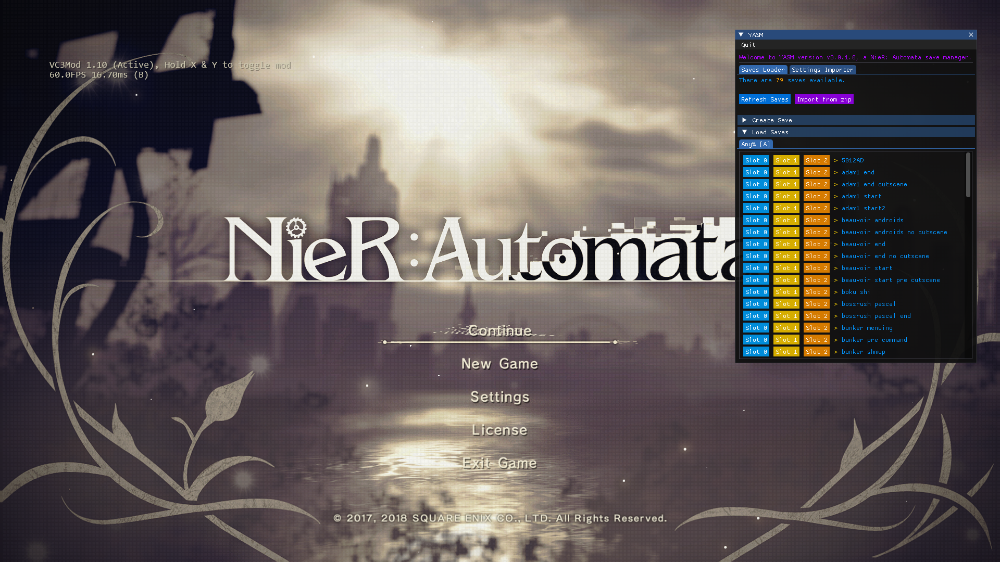
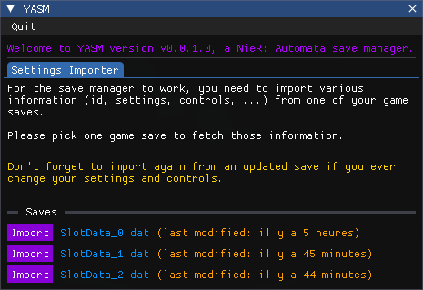
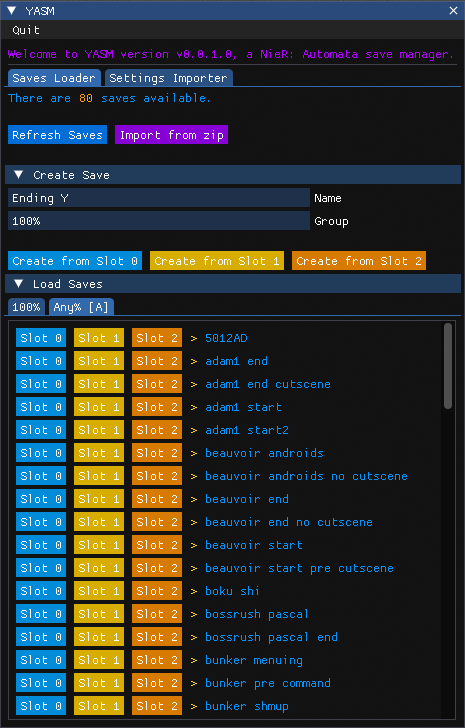

# YASM - Yet Another Save Manager for NieR: Automata

> A **NieR: Automata** tool that tries to help managing and importing save

## Setup

You can download this tool in the [Releases](https://github.com/Eveldee/YASM.NieRAutomata/releases). After downloading the `.zip` archive, extract it and run `YASM.NieRAutomata.exe`.

When you will first start the tool, you will be asked to import your settings _(steam id, game settings, controls)_ from an existing save, create on if you don't have any.

If you ever change your settings or controls, you can import an updated save again, this will apply your new settings to all the saves you load.

## Import saves

There are three different ways to import saves:
- Create a new save by expanding the `Create Save` header. This method will take one of your actual game saves and allow you to add a group and name to it for better organization.
- Import saves from a `.zip` archive (`.rar` archives are not supported at the moment)
- Copy saves manually to the `Saves` directory, all saves that are not in a subdirectory will end up in the `|Default` group

The saves and groups are always ordered by their name so feel free to add numbers to your save files to order them however you want _(`01. Prologue`, `02. Resistance Camp`, ...)_

## Usage

Once you have some saves to load, click on any `Slot` button to load a save in the corresponding slot, it will be copied to the game saves directory with your imported settings. You can then load the save slot and see the result.

> Note that it is possible to load a save even while the game is running but it is possible that the save slot preview won't be updated directly. Even if it happens, the correct save will still be loaded.

You can hide/toggle **YASM** by pressing the `ctrl + backspace` shortcut. Click the `Quit` button in the top-left corner to correctly close **YASM**.